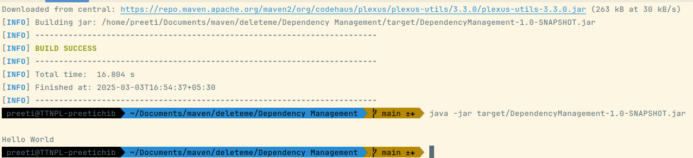

## Q4) Using JAR plugin, make changes in the pom.xml to make the jar executable. Using java -jar JAR_NAME, the output should be printed as "Hello World"
### Output of executable jar file
` java -jar target/DependencyManagement-1.0-SNAPSHOT.jar
`

