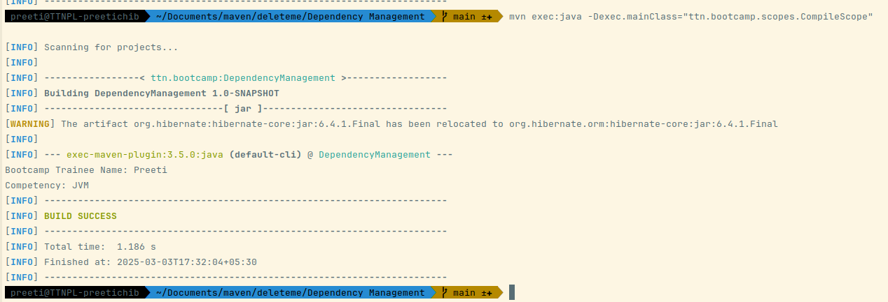
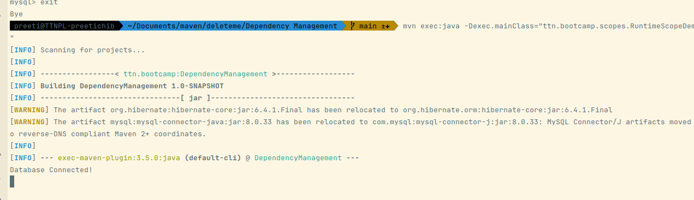
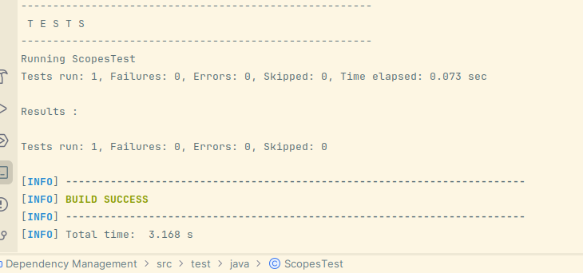
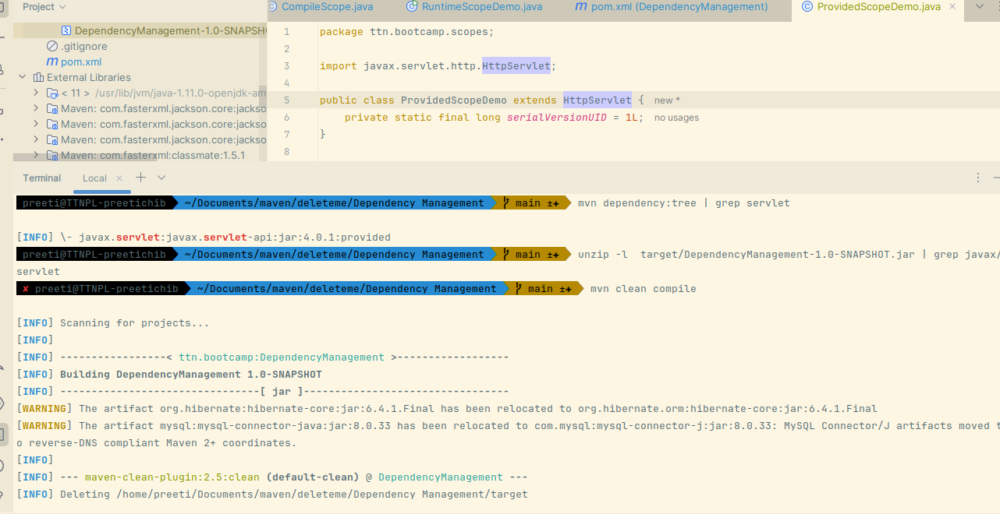

### Q5) Differentiate between the different dependency scopes: compile, runtime, test, provided using different dependencies being defined in your pom.xml.
### Compile Scope example
` mvn exec:java -Dexec.mainClass="ttn.bootcamp.scopes.CompileScope"
`


#### Runtime Scope Example
` mvn exec:java -Dexec.mainClass="ttn.bootcamp.scopes.RuntimeScopeDemo`



#### Test Scope Example
`mvn test`


### Provided Scope Example

Servlet is in the dependency tree
``` 
mvn dependency:tree | grep servlet

[INFO] \- javax.servlet:javax.servlet-api:jar:4.0.1:provided
```

But not included in the jar as this has no output
`unzip -l  target/DependencyManagement-1.0-SNAPSHOT.jar | grep javax/servlet
`

Yet we are able to compile and run code that is accessing this dependency
`mvn clean compile`

